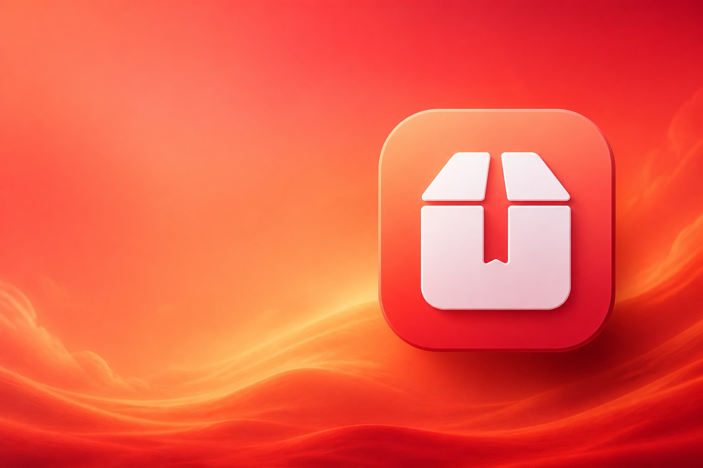

# ZipX

**压缩、解压、预览，样样好用。**

面向 macOS 的归档工具。先选文件，再选压缩 / 解压 / 预览。  
**Universal Binary**：同时支持 **Apple Silicon（M 系列）** 与 **Intel**。

[官网](https://linux503.github.io/ZipX/) · [下载 DMG](https://linux503.github.io/ZipX/downloads/ZipX-1.2.3-Universal.dmg) · [Releases](https://github.com/linux503/ZipX/releases)



## 功能亮点

| 能力 | 说明 |
| --- | --- |
| 压缩 / 解压 | ZIP、7Z、RAR（解压）开箱即用 |
| 预览 | 不解压查看包内文件列表 |
| 加密 / 分卷 / 固实 | 需要时再展开，默认流程干净 |
| 内置引擎 | 内置 Universal `7zz`，无需先装 Homebrew |
| 检查更新 | 启动可自动检查；设置里可手动更新 |
| 跨芯片 | arm64 + x86_64 同一安装包 |

> 创建 RAR 因版权限制无法内置，可在 App「设置」一键安装可选组件。

## 系统要求

- macOS 13.0+
- Apple Silicon 或 Intel

## 下载安装

1. 打开官网下载：[ZipX 1.2.3 Universal.dmg](https://linux503.github.io/ZipX/downloads/ZipX-1.2.3-Universal.dmg)
2. 打开 DMG，将 **ZipX** 拖到「应用程序」
3. 首次打开如遇安全提示：系统设置 → 隐私与安全性 → 仍要打开

本地构建：

```bash
./Scripts/build.sh      # 生成 dist/ZipX.app（arm64 + x86_64）
./Scripts/make_dmg.sh   # 生成 Universal DMG，并同步 docs/
./Scripts/install.sh    # 安装到 /Applications
```

## 官网

本仓库 `docs/` 即为 GitHub Pages 站点：

- 站点：https://linux503.github.io/ZipX/
- 更新源：https://linux503.github.io/ZipX/version.json

本地预览：

```bash
open docs/index.html
```

## 项目结构

```text
Sources/ZipX/     SwiftUI / AppKit 源码
Resources/        Info.plist、图标、内置 bin/7zz
Scripts/          build / dmg / install
docs/             官网与下载资源（GitHub Pages）
```

## 许可说明

- ZipX 源码按本仓库声明使用
- 内置 7-Zip（`Resources/bin/7zz`）遵循其原许可，详见 `Resources/bin/`

## 链接

- 官网：https://linux503.github.io/ZipX/
- GitHub：https://github.com/linux503/ZipX
- 问题反馈：https://github.com/linux503/ZipX/issues
