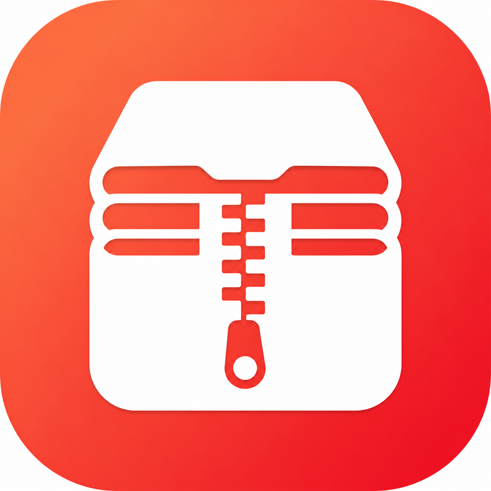

<p align="center">
  
</p>

<h1 align="center">ZipX</h1>

<p align="center">
  <strong>压缩、解压、预览，样样好用</strong><br/>
  先选文件，再选压缩 / 解压 / 预览。内置 7-Zip 与 RAR，无需 Homebrew。
</p>

<p align="center">
  <b>中文</b> · <a href="README.en.md">English</a>
</p>

<p align="center">
  <a href="https://github.com/linux503/ZipX/releases/latest"></a>
  <a href="https://github.com/linux503/ZipX/releases"></a>
  <a href="https://github.com/linux503/ZipX/releases"></a>
</p>

<p align="center">
  <a href="https://linux503.github.io/ZipX/downloads/ZipX-1.2.5-Universal.dmg"><strong>下载 DMG</strong></a>
  ·
  <a href="https://linux503.github.io/ZipX/">官网</a>
  ·
  <a href="https://github.com/linux503/ZipX/releases">全部版本</a>
</p>

---

<p align="center">
  
</p>

---

## 功能

面向 macOS 的归档工具。选好文件，再决定压缩、解压还是只看内容。一份 Universal 安装包同时支持 Apple Silicon 与 Intel。

| 能力 | 说明 |
|------|------|
| **压缩 / 解压** | ZIP、7Z、RAR 开箱即用（含 RAR 压缩与解压） |
| **预览** | 不解压查看包内文件列表，确认后再解 |
| **加密 / 分卷 / 固实** | 需要时再展开，默认流程干净 |
| **内置引擎** | 内置 Universal `7zz`，以及 `rar` / `unrar`，不用先装 Homebrew |
| **检查更新** | 启动可自动检查；设置里可手动更新 |

> RAR 引擎遵循 RARLab 许可，详见 `Resources/bin/RAR-LICENSE.txt`。

## 系统要求

- macOS **13.0** 或更高
- Apple Silicon 或 Intel

## 安装

1. 下载 [ZipX 1.2.5 Universal.dmg](https://linux503.github.io/ZipX/downloads/ZipX-1.2.5-Universal.dmg)
2. 打开 DMG，将 **ZipX** 拖到「应用程序」
3. 若 Gatekeeper 拦截：系统设置 → 隐私与安全性 → 仍要打开

### 从源码构建

```bash
git clone https://github.com/linux503/ZipX.git
cd ZipX
./Scripts/build.sh      # dist/ZipX.app（arm64 + x86_64）
./Scripts/install.sh    # 安装到 /Applications
./Scripts/make_dmg.sh   # Universal DMG，并同步 docs/
```

| 路径 | 内容 |
|------|------|
| `Sources/ZipX/` | SwiftUI / AppKit 源码 |
| `Resources/` | Info.plist、图标、内置 `bin/7zz` |
| `Scripts/` | 构建 / DMG / 安装 |
| `docs/` | 官网与下载资源（GitHub Pages） |

更新源：https://linux503.github.io/ZipX/version.json

## 其它工具

| 应用 | 说明 |
|------|------|
| [Flare Pro](https://github.com/linux503/Flare) | 截图与录屏 |
| [MacText](https://github.com/linux503/MacText) | 原生文本编辑器 |
| [SupTools](https://github.com/linux503/suptools) | 系统监控、清理、卸载 |
| [FilesDesk](https://github.com/linux503/FilesDesk) | 批量重命名 |
| [MacFan](https://github.com/linux503/MacFan) | 风扇转速 |

## 许可

- ZipX 源码按本仓库声明使用
- 内置 7-Zip（`Resources/bin/7zz`）遵循其原许可，见 `Resources/bin/`
- 问题反馈：[Issues](https://github.com/linux503/ZipX/issues)
